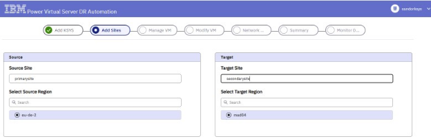
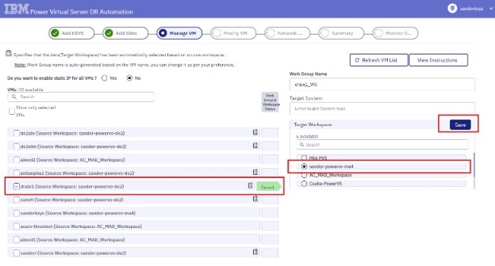
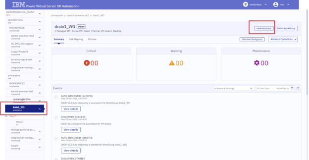

---

copyright:
  years: 2026
lastupdated: "2026-03-30"

keywords:

subcollection: pattern-pvs-ibmi-resiliency

---

{{site.data.keyword.attribute-definition-list}}

# Deploying Resilient IBM i workloads on {{site.data.keyword.powerSys_notm}}
{: #deploy}

This deployment guide outlines steps required to deploy AIX resilient environments in IBM Cloud PowerVS.

This is written for customers who need a resilient solution for their AIX LPARs in a multizone and multiregional layout. It details several different resiliency scenarios that can be deployed in PowerVS to protect business critical workloads running on AIX.
This guide only includes Operating system related resiliency methods and does not go into application or database layers.

The guide details how to deploy two different High availbility options:
- High Availability within a single Availability Zone (AZ)
- High Availability between two Availability Zones

And how to deploy two different Disaster Recovery options:
- Disaster Recovery with Global Replication Services (GRS)
- Disaster Recovery with Global Replication Services and Disaster Recovery Automation (DRA)

Additionally, the guide explains how to restore AIX from backup using mksysb images.

## Before you begin
{: #pvs-prereqs}

Before we begin, make sure that the following resources are in places as prerequisites.

### Prerequisites
{: #pvs-prereqs}

    Configure VPN (site-to-site or client-to-site) to reach the subnets of the PowerVS workspaces
    Make sure to create an ssh_key in the PowerVS workspaces once they are created.

#### Prerequisites for High Availability with PowerHA:
{: #ha-prereqs}

- Two PowerVS workspaces, both placed in one region but in different AZs
- PowerHA standard edition for local AZ High availability
- PowerHA enhanced edition with GLVM for High availability between AZs
- One Local transit gateway to connect the two AZs together

#### Prerequisites for Disaster Recovery with GRS:
{: #grs-prereqs}

- Two PowerVS workspaces, one in the "main" Cloud datacenter and one in the "secondary". Make sure they are selected based on the available GRS pairs. GRS pairs available in IBM Cloud: [Global Replication Services](https://cloud.ibm.com/docs/power-iaas?topic=power-iaas-getting-started-GRS#locations-GRS)
- One Global Transit Gateway to connect the two regions together.
- IBM Cloud CLI setup [Setup IBM Cloud CLI](https://cloud.ibm.com/docs/cli?topic=cli-getting-started)

#### Prerequisites for Global Replication services with Disaster Recovery Automation:
{: #prereqs-grs-dra}

Follow the steps in: [Disaster Recovery Automation](https://cloud.ibm.com/docs/dr-automation-powervs?topic=dr-automation-powervs-getting-started#prereqs)
We do not need the VPC schematics ID as we are going to use our own VPC with its subnet configured to a public gateway.

- Two PowerVS workspaces, one in the "main" Cloud data center and one in the "secondary". Make sure they are selected based on the available GRS pairs.
- One Global Transit Gateway to connect the two regions together.
- Two VPCs placed in each data center for the public gateways that will be used by the ksys orchestrator LPARs.
- API key for the cloud account user who will deploy the DRA.

### Deploying AIX High Availability with Standard PowerHA in a single Availability Zone
{: #deployment-steps}

    The following steps will help you deploy an AIX PowerHA cluster with shared storage. The two nodes are placed into the same AZ but different Power Servers. The guide only describes the configuration in IBM Cloud, it does not detail PowerHA configuration on AIX.

1. Create a PowerVS workspace within a single Availability Zone

Make sure that the workspace is PER enabled.

2. Create Server Placement Groups

    - Go into the Power Virtual Server workspace
    - Select Virtual Server instances
    - Select Server Placement Groups and Create Group
    - Make sure that the Colocation Policy is set to "Different Server"

3. Create Two AIX LPARs using the Colocation Policy and configure them for PowerHA clustering.

    - Create shared storage volumes for PowerHA repository disk and data disks.
    - In the Create Volume menu, make sure that the Shareable flag is ON.
    - It is best practice to protect the shared volumes with LVM mirroring to avoid single point of failures in our HA setup. LVM mirroring can be achieved by creating the same amount of storage volumes (with Shareable flag ON) and using anti-affinity option against the previously created storage volumes in the Create Volume menu. This will make sure that the volumes will come from two different Storage Pools.
    - Attach the storage volumes to the AIX LPARs
    - Configure LVM (make sure that the LVM mirror pairs comes from different Storage Pools) and PowerHA on the two AIX nodes.

4. Summary:

We have now two AIX LPARs created on two different Power servers, with Shared storage that can be configured with LVM mirroring.

### Deploying AIX High Availability with Enhanced edition PowerHA with GLVM (sync mode)
{: #deploy-ha-enhanced}

The following steps will help you deploy an AIX PowerHA cluster with GLVM, syncing data across two Availability Zones. The guide only describes the configuration in IBM Cloud, it does not detail PowerHA configuration on AIX.

1. Create two PowerVS workspaces, each placed in one Availability Zone. Make sure that the workspaces are PER enabled.

2. Create a Local Transit Gateway and add the two PowerVS workspaces to it.

3. Create two AIX LPARs in each PowerVS workspace and install PowerHA Enhanced Edition on them with GLVM filesets.

To be able to install GLVM with PowerHA Enhanced Edition install the following fileset:
glvm.rpv.server 5.4.1.0  - This can be found on each newly installed (using IBM Cloud image) AIX OS in directory: /usr/sys/inst.images/installp/ppc

4. Create a multi-site cluster (Linked cluster) with PowerHA software and configure GLVM.

Note that the two nodes will have different IP subnets and different service IP addresses. This is because we need to connect the two with Transit Gateway and we cannot use the same IP subnets on the TGW.

### Deploying AIX Disaster Recovery configuration with GRS and manual configuration.
{: #deploy-dr}

The following steps will help you deploy AIX systems with GRS enabled storage volumes, syncing data across Regions. Please note that Global Replication Services is as an asynchronous replication, therefore some data loss always excepted during failover.

1. Select two Regions that has GRS enabled in between.

2. Create two PowerVS workspaces within those Regions.

3. Deploy two AIX LPARs (a primary and a secondary) within each Regions' PowerVS workspace. Make sure that the boot disk of the primary AIX is set to GRS enabled during instance creation. The secondary AIX does not need any storage volumes attached.

4. Create GRS Volume Replication Group (VRG) under the PowerVS workspace Storage volumes menu (there can be more than one VRG created if needed). The GRS enabled storage volumes are going to be placed into the VRG after they get attached to the AIX LPAR.

5. Create GRS enabled storage volumes at the primary region and attach them to the primary AIX LPAR. Make sure the GRS enabled storage volumes are attached to the AIX LPAR before attempting to add it to the VRG. After the GRS enabled storage volume is on the AIX LPAR it will show "Replication status" - Action Required.

6. Add the GRS enabled storage volumes at the primary region to the VRG created at step 4.

7. Wait until the VRG state becomes "Consistent copying"

8. The GRS secondary storage volume, called auxiliary volumes, are now created at the secondary region, however they cannot be seen under the secondary PowerVS workspace until they get "Onboarded". To "Onboard" an auxiliary storage volume the user need IBM Cloud CLI. Use [Onboard Auxiliary volumes](https://cloud.ibm.com/docs/power-iaas?topic=power-iaas-getting-started-GRS#onboarding-an-auxiliary-volume) to make the auxiliary volumes available at the secondary site.

9. Once the Auxiliary volumes can be seen at the secondary PowerVS workspace, they can be added to the secondary AIX LPAR. Both the boot and the data disks should be attached to the secondary AIX LPAR.

10. Perform a failover from primary site to secondary site [GRS manual failover](https://cloud.ibm.com/docs/power-iaas?topic=power-iaas-getting-started-GRS#failover-sec-loc)

11. Perform a fallback from secondary site to primary site [GRS manual fallback](https://cloud.ibm.com/docs/power-iaas?topic=power-iaas-getting-started-GRS#fallback-prim-loc)

12. To clear up GRS storage volumes see [Deleting GRS enabled Storage volume](https://cloud.ibm.com/docs/power-iaas?topic=power-iaas-getting-started-GRS#delete-prime-vol)

### Deploying AIX Disaster Recovery configuration with Disaster Recovery Automation
{: #deploy-dra}

The following steps will help you deploy AIX systems with GRS enabled storage volumes, syncing data across Regions. Please note that Global Replication Services is as an asynchronous replication, therefore some data loss is always expected after a failover. We are going to use Disaster Recovery Automation to automate the failover and fallback operations. This deployment guide will only describe the configuration without ksys High Availability.

1. Create two PowerVS workspaces in two different Regions, that are GRS replication pairs.

2. Create a Global Transit Gateway and add the primary PowerVS workspace to it. Do not add the secondary PowerVS workspace as it will be done when we deploy the Disaster Recovery Automation from the IBM Cloud Catalog.

3. Create a VPC in the secondary Region. The VPC will be used to place our Public Gateway Virtual Machine. The Public Gateway is going to allow the ksys orchestrator LPAR to reach IBM Cloud Services. Follow the steps to configure Public Gateway: [Enable Communication via VPC](https://cloud.ibm.com/docs/dr-automation-powervs?topic=dr-automation-powervs-idep-the-orch#procedure-ena-ppro-comm)

4. Deploy the Disaster Recovery Automation from the IBM Cloud Catalog. Search for Power Virtual Server DR Automation "Select a location" should be set to Global, Global is the only location that allows us to select PowerVS DR Automation Pricing Plan. Do not go with the private one as that is for between on-prem and IBM Cloud. Add a name to the service and a resource group.

5. Once the service is created for the DRA we will be able to see it under the IBM Cloud Account's Resource List menu. Click on the service and a setup menu will appear for the initial configuration of the DRA.

6. Guidance to fill out the configuration menu:

    | Question | Value |
    | -------- | ------|
    | DR Orchestrator name | Can be anything
    |DR Orchestrator password | Is the password for root user(will be used to login to the orchestrator interface from the internet) |
    | IBM Cloud API key | The API key for the cloud user. |
    | DR location | The location of the DR PowerVS workspace (where we want to restore our LPAR). The ksys orchestrator will be placed there as well. |
    |Custom VPC | Use manually created proxy VSI|
    |Proxy details | Use the Private IP address of the proxy server and the squid port, eg.: 10.83.64.5:3128 |
    | DR Power Virtual Server workspace |The name of the secondary PVS workspace, that resides in the DR location.|
    |Use a secret | Untick the box and select the ssh key name for ssh key. |
    |Storage tier | Tier for the ksys orchestrator to run on. |
    |Machine type | What type of power machine will host the ksys orchestrator  |
   {: caption="Guidance for configuration menu" caption-side="bottom"}

7. Reach the ksys orchestrator via web browser to configure the DRA:

    https://private_IP_of_ksys_orchestrator:3000

8. Add Sites Add the two sites to the configuration, again, they must be GRS enabled regions. {: caption="Figure 1: Configure Sites with DRA" caption-side="bottom"}{: external download="DRA_Site_Config.svg"}

9. Manage VM
- Create New Session
- Select the Primary Logical Partition (VM) on the left side
- Select the target PowerVS workspace on the right side
- Name your Work Group at Work Group Name
- Save the settings
- This will create a WorkGroup for the LPAR. With DRA, only Work groups can be moved between sites instead of individual LPARs. {: caption="Figure 2: Manage VM" caption-side="bottom"}{: external download="Manage_VM.svg"}

10. After checking the summary -> Submit & Deploy

11. Failover to the secondary site
- Select the work group that contains the primary LPAR
- Select Move Work Group at the top left {: caption="Figure 3: LPAR_Failover" caption-side="bottom"}{: external download="LPAR_Failover.svg"}

12. Check the events logged in the ksys orchestrator web page, additionally the progression can be verified by checking the secondary site's PowerVS workspace.

### Restore AIX Operating system using mksysb image
{: #restore-aix}

    This part focuses only on the Operating system and does not detail application or database file restore.

In IBM Cloud there are several supported ways to restore an AIX Operating system.

1. Save mksysb images on a NIM server created in the same PowerVS workspace as the protected LPAR. A NIM server works the same way as it would at on-prem locations. The NIM server can also be protected with NIM-HA utility, a secondary NIM server can be placed into another Availability Zone or Region.

2. Save mksysb images in Cloud Object Storage (COS), download them to a freshly installed AIX with S3, and restore mksysb with alt_disk_install utilities. This option does not require a NIM server, however it is always recommended to have at least one NIM server in an AIX environment.
    - Install and configure aws-cli to be installed on the AIX system:
        - Install on AIX: [AWS CLI how to](https://cloud.ibm.com/docs/power-iaas?topic=power-iaas-additional-migration-strategies-power#migration-icos)
        - Configure on AIX: [AWS configure](https://cloud.ibm.com/docs/cloud-object-storage?topic=cloud-object-storage-aws-cli#aws-cli-config)

    - Download the mksysb image from the configured COS bucket with AWS CLI

    $ aws s3 cp s3://bucketname/mksysbimage /tmp/mksysb --endpoint-url https://s3.private.eu-de.cloud-object-storage.appdomain.cloud

    - restore mksysb to an empty disk (same size as the rootvg disk where the mksysb was generated)

    $ alt_disk_mksysb -m /tmp/mksysb/mksysbfile -d hdiskX -k

    - The alt_disk_mksysb automatically sets the bootlist, restart the LPAR to boot from the restored disk volume.

    $ shutdown -Fr

3. Save mksysb images into Cloud Object Storage (COS) and restore the system by creating PowerVS workspace images using the Cloud GUI.
- The mksysb image cannot be directly used to import an image in the workspace from COS. The mksysb must be turned into an ova image first. The acceptable mksysb extensions: .ova, .ova.gz, .tar, .tar.gz, .tgz, .ova.tgz
- The mksysb can be turned into an ova file with "create_ova" command. See the following as an example to restore mksysb from COS by turning it into an ova image:
    - Create an mksysb on AIX (exclude not needed files with /etc/exclude.rootvg)

    $ mksysb -e -i -X /install/mksysb/saixmk

    - Create an ova image with create_ova command, this requires an empty disk (same size as the rootvg disk) as it restores the AIX to turn the mksysb into an ova file.

    $ nohup create_ova -o /install/ova -d hdisk0 -i /install/mksysb/saixmk -t aix &
    - Create a COS and a COS bucket under the IBM Cloud account.

    - Create service credentials for the COS with HMAC key enabled (this will be needed to create a boot image) Make sure that you set Manager as a role or equal in IAM for Cloud Object Storage resource.Note down the HMAC access key and secret access key.
    - Transfer the ova image into the cloud bucket
    - create a boot image from the ova file from COS using Import Image under the PowerVS workspace Boot Images section.
    - Attach the created boot image volume to a freshly created (or already existing) AIX.
    - Run cfgmgr command on AIX to configure the new boot volume.
    - Set the bootlist to point to the new disk.
    - Restart the LPAR to make it boot from the restored ova image
     $ shutdown -Fr

### Restore AIX LPAR with Instance Snapshots
{: #restore-snapshots}

    Instance snapshots save the state of a set of volumes attached to a virtual server instance at a specific time. When an instance snapshot is restored, data is reverted to the time the instance snapshot was taken.

1. In the PowerVS workspace select Instance Snapshots under the Storage section.

2. Create Instance Snapshot, name the snapshot and select the LPAR. Mark all the disks of the selected LPAR if there is a need to restore AIX with all its data volumes. If only the AIX Operating system needs to be captured and restored, select only the boot storage volume.

3. After "Create" the Instance snapshot will be ready to be used for restore operations. To restore the instance, click on the instance snapshot name, then select Actions and Restore. Make sure to stop the LPAR before the restore operation. The restore operation will completely rewrite all the storage volumes of the LPAR with the captured images.

4. After the restore, start the LPAR.
